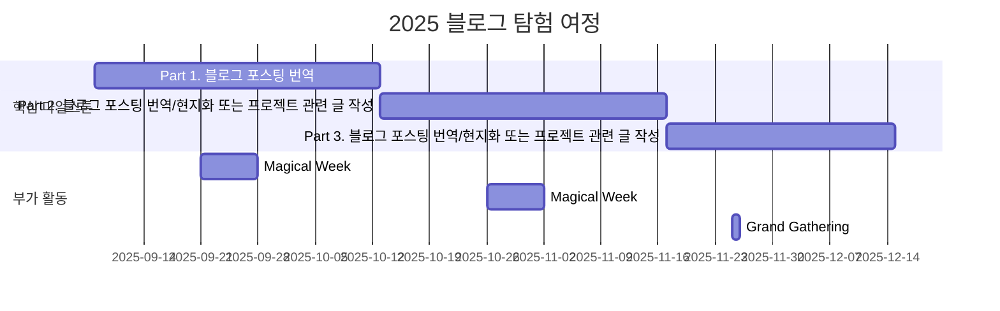

# Hugging Face 블로그 탐험가

<h1 align="center"> Hugging Face 블로그 탐험가 </h1>

 

<!-- sheilds: https://shields.io/ -->
<!-- hits badge: https://hits.seeyoufarm.com/ -->

> 블로그 탐험가가 되어 Hugging Face라는 생태계를 탐구하고 블로그를 통해 알려봅시다 🤠
> 

## 🌟 프로젝트 목표 (Project Vision)
- Hugging Face 공식 블로그 포스팅 번역으로 시작해 자신만의 컨텐츠를 만들며
- Hugging Face 생태계에 기여하고 AI 분야에서 성장하는 것에 더불어
- Hugging Face KREW와 자신의 경험을 적극적으로 공유하는 것을 목표로 합니다.

## 🧑 역동적인 팀 소개 (Dynamic Team)

| 역할          | 이름 |  프로젝트 내 포지션                                                                | 
|---------------|------|-----------------------------------------------------------------------|
| **Project Manager** | 심소현 | 탐험대장(오락부장) | 
| **Member** | 안정 |  | 
| **Member** | 윤현서 |  | 
| **Member** | 안지민 |  | 
| **Member** | 이효정 |  | 
| **Member** | 정우준 | 넉살(보드게임장) | 
| **Member** | 조영준 | 깍두기(리액션담당) | 
| **Member** | 좌민주 | 찍먹가(처음 해보는 것 찍먹하고 공유하기) | 

## 🚀 프로젝트 로드맵 (Project Roadmap)

## 🚩 도전과제 (Achievements)
**팀 목표**
- Hugging Face 공식 블로그 한국어 페이지 개설
- Hugging Face 공식 문서 번역 Agent MCP 서버 개발 및 관련 컨텐츠 배포

**개인 목표**
- 각자 3개 이상의 블로그 포스팅 작성하여 KREW 블로그에 게재

## 🛠️ 우리의 개발 문화 (Our Development Culture)
- Hugging Face KREW 블로그의 [🤗 어떻게 기여하나요?](https://hugging-face-krew.github.io/how-to-contribute/#blog) 포스팅을 참고해주세요!

## 💻 주차별 활동 (Activity History)

| 날짜 | 내용 | 발표자 | 발표 자료 |
| -------- | -------- | ---- | --- |
| 2025/09/09 | OT       |      | --- |
| 2025/09/16 | 블로그 번역 1 [Implementing MCP Servers in Python: An AI Shopping Assistant with Gradio](https://huggingface.co/blog/gradio-vton-mcp) | 심소현 @sim-so |  |
|  | 블로그 번역 2 [Tiny Agents in Python: an MCP-powered agent in ~70 lines of code](https://huggingface.co/blog/python-tiny-agents) | 좌민주 @Jwaminju |  |
| 2025/09/23 | _Magical Week_ |  |  |
| 2025/09/30 |  블로그 번역 3 | 안정 | [smolagents](https://huggingface.co/blog/smolagents) |
|  |  블로그 번역 4 [Building the Hugging Face MCP Server](https://huggingface.co/blog/building-hf-mcp) | 윤현서 |  |
| 2025/10/06 |  블로그 번역 5 [MCP for Research: How to Connect AI to Research Tools](https://huggingface.co/blog/mcp-for-research) | 이효정 |  |
|  |  블로그 번역 6 [Vision Language Models (Better, Faster, Stronger)](https://huggingface.co/blog/vlms-2025) | 조영준 |  |
| 2025/10/13 |  블로그 번역 7 [CodeAgents + Structure: A Better Way to Execute Actions](https://huggingface.co/blog/structured-codeagent) | 안지민 | 
|  |  블로그 번역 8 [Vision Language Models Explained](https://huggingface.co/blog/vlms) | 정우준 |  |
| 2025/10/20 | 블로그 번역 1 | 미정 |  |
|  | 블로그 번역 2 | 미정 |  |
|  | 블로그 번역 Wrap Up | 미정 |  |
| 2025/10/27 | _Magical Week_ |  |  |
| 2025/11/03 |  |  |  |
| 2025/11/10 |  |  |  |
| 2025/11/17 |  |  |  |
| 2025/11/24 |  |  |  |
| 2025/12/01 |  |  |  |
| 2025/12/08 |  |  |  |
| 2025/12/15 |  |  |  |
| 2025/12/22 | Wrap Up |  |  |

## 💡 학습 자원 (Learning Resources)
**우리가 만든 지식 허브**  
- [Hugging Face KREW 블로그](https://github.com/Hugging-Face-KREW/hugging-face-krew.github.io)
- [Hugging Face 공식 Blog](https://huggingface.co/blog)

## 🌱 참여 안내 (How to Engage)
❗️참여 링크: [가짜연구소 디스코드](https://discord.gg/EPurkHVtp2)

❗️커뮤니케이션 채널: 디스코드 #hugging-face-블로그-탐험가

**누구나 청강을 통해 모임을 참여하실 수 있습니다.**  
- 시간: 매주 월요일 오후 10시-11시
- 디스코드 #Room-YL 채널로 입장
- Pseudo Lab 행사에서도 만나실 수 있어요!

## Acknowledgement 🙏

Hugging Face 블로그 탐험가 프로젝트는 가짜연구소 Open Academy로 진행됩니다.
여러분의 참여와 기여가 ‘우연한 혁명(Serendipity Revolution)’을 가능하게 합니다. 모두에게 깊은 감사를 전합니다.
Hugging Face KREW Blog Explorer is developed as part of Pseudo-Lab's Open Research Initiative. Special thanks to our contributors and the open source community for their valuable insights and contributions.

## About Pseudo Lab 👋🏼</h2>

[Pseudo-Lab](https://pseudo-lab.com/) is a non-profit organization focused on advancing machine learning and AI technologies. Our core values of Sharing, Motivation, and Collaborative Joy drive us to create impactful open-source projects. With over 5k+ researchers, we are committed to advancing machine learning and AI technologies.

<h2>Contributors 😃</h2>

  

<h2>License 🗞</h2>

This project is licensed under the [MIT License](https://opensource.org/licenses/MIT).
